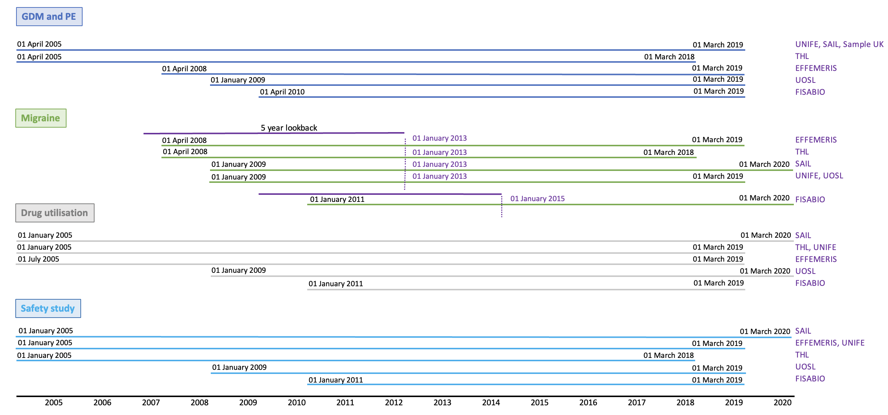

```{css,  echo = F}
/*-- Specify div's for 'boxes', change color of TOC and center align titles: --*/
div.box1 {background-color: #f5f5f0; border-radius: 5px; padding: 30px; margin-right: 0px}
div.box2 {border-style: solid; border-color: #f5f5f0; border-width: medium; border-radius: 30px; padding: 5px; margin-right: 0px}
div.box3 {border-style: solid; border-color: #f5f5f0; border-width: medium; border-radius: 30px; padding: 5px; margin-right: 0px}
div.box4 {border-style: solid; border-color: #f5f5f0; border-width: medium; border-radius: 30px; padding: 5px; margin-right: 0px}
div.box5 {border-style: solid; border-color: #f5f5f0; border-width: medium; border-radius: 30px; padding: 5px; margin-right: 0px}
div.box6 {border-style: solid; border-color: #f5f5f0; border-width: medium; border-radius: 30px; padding: 5px; margin-right: 0px}
div.box7 {border-style: solid; border-color: #f5f5f0; border-width: medium; border-radius: 30px; padding: 5px; margin-right: 0px}
div.box8 {border-style: solid; border-color: #f5f5f0; border-width: medium; border-radius: 30px; padding: 5px; margin-right: 0px}
div.box9 {border-style: solid; border-color: #f5f5f0; border-width: medium; border-radius: 30px; padding: 5px; margin-right: 0px}

.list-group-item.active, .list-group-item.active:focus, .list-group-item.active:hover {background-color: #76b82a; border-color: #76b82a}
h1 {text-align: center; color: #3c7b8a}
h2 {text-align: center; color: #76b82a}
h3

/*-- Add logo (based on https://rstudio4edu.github.io/rstudio4edu-book/rmd-fancy.html): --*/
#TOC::before {content: ""; display: block; height: 60px; margin: 30px 10px 30px; background-image: url("conception_logo.png"); background-size: contain; background-position: center center; background-repeat: no-repeat}
```

```{r set_locale, include=FALSE}
Sys.setlocale("LC_ALL", "C")
`%!in%` = Negate(`%in%`)
```

<div class = 'box1'>

Minimum and maximum dates of start date of pregnancy records for all projects by DAP

<br>



</div>

<br>

<div class = 'box2'>

## 1. Application of pregnancy algorithm and records quality

Step 1: application of the Pregnancy algorithm(developed by ARS Toscana team).     
Step 2: keep only pregnancy records with quality=="green".     

<br>

Removed records with quality other than green
```{r preg_excl_criteria_same, echo=F}
if("other_quality_records_removed.csv" %in% list.files(paste0(projectFolder,"/g_output/Pregnancy algorithm/"))){
removed_rec<-fread(paste0(projectFolder,"/g_output/Pregnancy algorithm/other_quality_records_removed.csv"))
datatable(removed_rec, options = list(scrollX=T))
}else{
  print("This table is missing in the folder g_output/Pregnancy algorithm.")
}
```

</div>

<br>

<div class = 'box3'>

## 2. Application of the same exclusion criteria to pregnancy D3  

Below all indicators and number of removed records is explained.

```{r removed_rec, echo=F}
if("issues_flowchart_pregnancy_D3.csv" %in% list.files(paste0(projectFolder,"/g_output/Pregnancy algorithm/"))){
excl_criteria_same<-fread(paste0(projectFolder,"/g_output/Pregnancy algorithm/issues_flowchart_pregnancy_D3.csv"))
datatable(excl_criteria_same, options = list(scrollX=T))
}else{
  print("This table is missing in the folder g_output/Pregnancy algorithm.")
}
```

</div>

<br>

<div class = 'box4'>

## 3. Application of the specific exclusion criteria to pregnancy D3 for GDM and PE algorithm

```{r gdm_pe_flowchart, echo=F}
if("issues_GDM_PE_flowchart_pregnancy_D3.csv" %in% list.files(paste0(projectFolder,"/g_output/Pregnancy algorithm/"))){
excl_criteria_gdm_pe<-fread(paste0(projectFolder,"/g_output/Pregnancy algorithm/issues_GDM_PE_flowchart_pregnancy_D3.csv"))
datatable(excl_criteria_gdm_pe, options = list(scrollX=T))
}else{
  print("This table is missing in the folder g_output/Pregnancy algorithm.")
}
```


</div>

<br>

<div class = 'box5'>

## 4. Application of the specific exclusion criteria to pregnancy D3 for Migraine algorithm

```{r mig_flowchart, echo=F}
if("issues_Migraine_flowchart_pregnancy_D3.csv" %in% list.files(paste0(projectFolder,"/g_output/Pregnancy algorithm/"))){
excl_criteria_mig<-fread(paste0(projectFolder,"/g_output/Pregnancy algorithm/issues_Migraine_flowchart_pregnancy_D3.csv"))
datatable(excl_criteria_mig, options = list(scrollX=T))
}else{
  print("This table is missing in the folder g_output/Pregnancy algorithm.")
}
```

</div>

<br>

<div class = 'box6'>

## 5. Application of the specific exclusion criteria to pregnancy D3 for the Drug utilization study

```{r du_flowchart, echo=F}
if("issues_DU_flowchart_pregnancy_D3.csv" %in% list.files(paste0(projectFolder,"/g_output/Pregnancy algorithm/"))){
excl_criteria_du<-fread(paste0(projectFolder,"/g_output/Pregnancy algorithm/issues_DU_flowchart_pregnancy_D3.csv"))
datatable(excl_criteria_du, options = list(scrollX=T))
}else{
  print("This table is missing in the folder g_output/Pregnancy algorithm.")
}
```

</div>

<br>

<div class = 'box7'>

## 6. Application of the specific exclusion criteria to pregnancy D3 for the Safety study

```{r saf_flowchart, echo=F}
if("issues_Safety_flowchart_pregnancy_D3.csv" %in% list.files(paste0(projectFolder,"/g_output/Pregnancy algorithm/"))){
excl_criteria_saf<-fread(paste0(projectFolder,"/g_output/Pregnancy algorithm/issues_Safety_flowchart_pregnancy_D3.csv"))
datatable(excl_criteria_saf, options = list(scrollX=T))
}else{
  print("This table is missing in the folder g_output/Pregnancy algorithm.")
}
```

</div>

<br>

<div class = 'box8'>

## 7. Summary of included records for all projects by year of start pregnancy date

```{r included_rec, echo=F}
if("included_records_pregnancy_D3.csv" %in% list.files(paste0(projectFolder,"/g_output/Pregnancy algorithm/"))){
incl_rec<-fread(paste0(projectFolder,"/g_output/Pregnancy algorithm/included_records_pregnancy_D3.csv"))
datatable(incl_rec, options = list(scrollX=T))
}else{
  print("This table is missing in the folder g_output/Pregnancy algorithm.")
}
```
