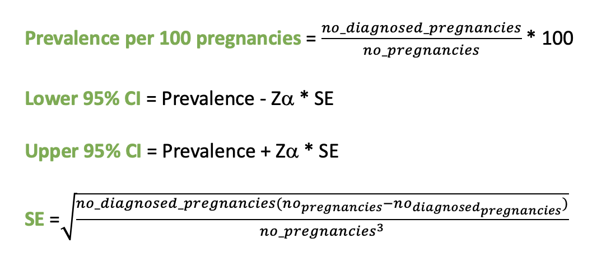

```{css,  echo = F}
/*-- Specify div's for 'boxes', change color of TOC and center align titles: --*/
div.box1 {background-color: #f5f5f0; border-radius: 5px; padding: 30px; margin-right: 0px}
div.box2 {background-color: #d4e5d2; border-radius: 5px; padding: 30px; margin-right: 0px}

div.box3 {border-style: solid; border-color: #f5f5f0; border-width: medium; border-radius: 30px; padding: 5px; margin-right: 0px; text-align: justify}

.list-group-item.active, .list-group-item.active:focus, .list-group-item.active:hover {background-color: #76b82a; border-color: #76b82a}
h1 {text-align: center; color: #3c7b8a}
h2 {text-align: center; color: #76b82a}
h3

/*-- Add logo (based on https://rstudio4edu.github.io/rstudio4edu-book/rmd-fancy.html): --*/
#TOC::before {content: ""; display: block; height: 60px; margin: 30px 10px 30px; background-image: url("conception_logo.png"); background-size: contain; background-position: center center; background-repeat: no-repeat}
```

```{r set_locale, include=FALSE}
Sys.setlocale("LC_ALL", "C")
`%!in%` = Negate(`%in%`)
```


<div class = 'box1'>
General information:

-   **Script directory:** `r projectFolder`
-   **Date/time:** `r Sys.time()`
-   **DAP:** `r data_access_provider_name`
-   **Data source:** `r data_source_name`

</div>

<br>

<div class = 'box2'>
```{r time_log, echo=F}
timelog<-fread(paste0(projectFolder,"/g_output/Time log/", "Step_04_time_log.csv" ))
timelog_2<-fread(paste0(projectFolder,"/g_output/Time log/", "Step_04_e_time_log.csv" ))

kable(timelog)
kable(timelog_2)
```

```{r, echo=F}
if("timelog" %in% ls()){rm(timelog)}
if("timelog_2" %in% ls()){rm(timelog_2)}
```

</div>

<br>

<div class = 'box3'>
Start and end study dates for all projects by DAP

<br>


</div>

<br>

<div class = 'box3'>



</div>

<br>

<div class = 'box3'>

<br>

**Study dates for the DAP of interest**\

```{r ,echo=F}
if("inclusion_dates_flowchart.csv" %in% list.files(paste0(projectFolder,"/g_output/Migraine algorithm/"))){
dates_flowchart<-fread(paste0(projectFolder,"/g_output/Migraine algorithm/inclusion_dates_flowchart.csv"))
datatable(dates_flowchart, extensions = "Buttons", options = list(scrollX=T,
                                                                    dom = "Blfrtip",
                                                                    buttons = c("copy", "csv","excel", "pdf", "print"),
                                                                                lengthMenu = list(c(10,25,50,-1),
                                                                                                  c(10,25,50,"All"))))
}else{
  print("This table is missing in the folder g_output/Migraine algorithm or g_output/Migraine algorithm.")
}
```

```{r, echo=F}
if("dates_flowchart" %in% ls()){rm(dates_flowchart)}
```

</div>
<br>


<div class = 'box3'>

**Observation period of interest for Migraine diagnoses**\

`start_date`: The pregnancy start date\
`lookback`: The time period before pregnancy start date\
`end_date`: The pregnancy end date\
`after`: The time period after pregnancy end date\

<br>

```{r ,echo=F}
if("Step_04_observation_periods_migraine.csv" %in% list.files(paste0(projectFolder,"/g_output/Migraine algorithm/"))){
obs<-fread(paste0(projectFolder,"/g_output/Migraine algorithm/Step_04_observation_periods_migraine.csv"))
}else{
 obs<-NULL 
}

if(!is.null(obs)){datatable(obs, extensions = "Buttons", options = list(scrollX=T,
                                                                    dom = "Blfrtip",
                                                                    buttons = c("copy", "csv","excel", "pdf", "print"),
                                                                                lengthMenu = list(c(10,25,50,-1),
                                                                                                  c(10,25,50,"All"))))}else{
  print("This table is missing in the folder g_output/Migraine algorithm.")
}
```

```{r, echo=F}
if("obs" %in% ls()){rm(obs)}
```

</div>

<br>

<div class = 'box3'>

## 2. Creation of the Migraine Type Algorithms: Baseline

If the prevalence is rounded to zero but the number of diagnosed pregnancies is higher than zero than the prevalence will be replaced with 0.0001.
<br>

### 2.1 Baseline Migraine Type Algorithm Overall


```{r , echo=F}
if("Step_04_MIG_T1_a.csv" %in% list.files(paste0(projectFolder,"/g_output/Migraine algorithm/"))){
alg_1<-fread(paste0(projectFolder,"/g_output/Migraine algorithm/Step_04_MIG_T1_a.csv"))
}else{alg_1<-NULL}

if("Step_04_MIG_T2_a.csv" %in% list.files(paste0(projectFolder,"/g_output/Migraine algorithm/"))){
alg_2<-fread(paste0(projectFolder,"/g_output/Migraine algorithm/Step_04_MIG_T2_a.csv"))
}else{alg_2<-NULL}

if("Step_04_MIG_T3_a.csv" %in% list.files(paste0(projectFolder,"/g_output/Migraine algorithm/"))){
alg_3<-fread(paste0(projectFolder,"/g_output/Migraine algorithm/Step_04_MIG_T3_a.csv"))
}else{alg_3<-NULL}

if("Step_04_MIG_T4_a.csv" %in% list.files(paste0(projectFolder,"/g_output/Migraine algorithm/"))){
alg_4<-fread(paste0(projectFolder,"/g_output/Migraine algorithm/Step_04_MIG_T4_a.csv"))
}else{alg_4<-NULL}

if("Step_04_MIG_T5_a.csv" %in% list.files(paste0(projectFolder,"/g_output/Migraine algorithm/"))){
alg_5<-fread(paste0(projectFolder,"/g_output/Migraine algorithm/Step_04_MIG_T5_a.csv"))
}else{alg_5<-NULL}

if("Step_06_MIG_T5_a.csv" %in% list.files(paste0(projectFolder,"/g_output/Migraine algorithm/"))){
alg_6<-fread(paste0(projectFolder,"/g_output/Migraine algorithm/Step_04_MIG_T6_a.csv"))
}else{alg_6<-NULL}


if("Step_04_MIG_T1_b.csv" %in% list.files(paste0(projectFolder,"/g_output/Migraine algorithm/"))){
alg_7<-fread(paste0(projectFolder,"/g_output/Migraine algorithm/Step_04_MIG_T1_b.csv"))
}else{alg_7<-NULL}

if("Step_04_MIG_T2_b.csv" %in% list.files(paste0(projectFolder,"/g_output/Migraine algorithm/"))){
alg_8<-fread(paste0(projectFolder,"/g_output/Migraine algorithm/Step_04_MIG_T2_b.csv"))
}else{alg_8<-NULL}

if("Step_04_MIG_T3_b.csv" %in% list.files(paste0(projectFolder,"/g_output/Migraine algorithm/"))){
alg_9<-fread(paste0(projectFolder,"/g_output/Migraine algorithm/Step_04_MIG_T3_b.csv"))
}else{alg_9<-NULL}

if("Step_04_MIG_T4_b.csv" %in% list.files(paste0(projectFolder,"/g_output/Migraine algorithm/"))){
alg_10<-fread(paste0(projectFolder,"/g_output/Migraine algorithm/Step_04_MIG_T4_b.csv"))
}else{alg_10<-NULL}

if("Step_04_MIG_T5_b.csv" %in% list.files(paste0(projectFolder,"/g_output/Migraine algorithm/"))){
alg_11<-fread(paste0(projectFolder,"/g_output/Migraine algorithm/Step_04_MIG_T5_b.csv"))
}else{alg_11<-NULL}

if("Step_04_MIG_T6_b.csv" %in% list.files(paste0(projectFolder,"/g_output/Migraine algorithm/"))){
alg_12<-fread(paste0(projectFolder,"/g_output/Migraine algorithm/Step_04_MIG_T6_b.csv"))
}else{alg_12<-NULL}

alg<-rbind(alg_1,alg_2,alg_3,alg_4,alg_5,alg_6,alg_7,alg_8,alg_9,alg_10,alg_11,alg_12)

alg1<-rbind(alg_1,alg_2,alg_3,alg_4,alg_5,alg_6)
alg2<-rbind(alg_7,alg_8,alg_9,alg_10,alg_11,alg_12)

if(!is.null(alg)){
  datatable(alg, extensions = "Buttons", options = list(scrollX=T,
                                                                    dom = "Blfrtip",
                                                                    buttons = c("copy", "csv","excel", "pdf", "print"),
                                                                                lengthMenu = list(c(10,25,50,-1),
                                                                                                  c(10,25,50,"All"))))
}else{
  print("This table is missing in the folder g_output/Migraine algorithm.")
}
```

```{r, echo=F}
if(!is.null(alg1)){
  ggplotly(ggplot(alg1) +
  geom_col(aes(x = factor(algorithm,levels =c('MIG_T1_a','MIG_T2_a','MIG_T3_a','MIG_T4_a','MIG_T5_a', 'MIG_T6_a')),  
               y = no_diagnosed_pregnancies), fill = "green", width = 0.3) +
  geom_col(aes(x = algorithm, y = no_pregnancies), alpha = 0.3, fill = "#76b82a", width = 0.6) +
      ggtitle("Migraine type baseline prevalence rates")+
xlab("Algorithm") +
  ylab("Counts")+
  theme(axis.text.x = element_text(size = 8,angle = 45),
        axis.title.x = element_text(colour = "#76b82a"),
        axis.title.y = element_text(colour = "#76b82a"),
        plot.title = element_text(colour = "#76b82a"))+
  theme_classic()
)
}
```

```{r, echo=F}
if(!is.null(alg2)){
  ggplotly(ggplot(alg2) +
  geom_col(aes(x = factor(algorithm,levels =c( 'MIG_T1_b','MIG_T2_b','MIG_T3_b','MIG_T4_b','MIG_T5_b','MIG_T6_b')),  
               y = no_diagnosed_pregnancies), fill = "green", width = 0.3) +
  geom_col(aes(x = algorithm, y = no_pregnancies), alpha = 0.3, fill = "#76b82a", width = 0.6) +
      ggtitle("Migraine type baseline prevalence rates")+
xlab("Algorithm") +
  ylab("Counts")+
  theme(axis.text.x = element_text(size = 8,angle = 45),
        axis.title.x = element_text(colour = "#76b82a"),
        axis.title.y = element_text(colour = "#76b82a"),
        plot.title = element_text(colour = "#76b82a"))+
  theme_classic()
)
}
```

```{r, echo=F}
if("alg_1" %in% ls()){rm(alg_1)}
if("alg_2" %in% ls()){rm(alg_2)}
if("alg_3" %in% ls()){rm(alg_3)}
if("alg_4" %in% ls()){rm(alg_4)}
if("alg_5" %in% ls()){rm(alg_5)}
if("alg_6" %in% ls()){rm(alg_6)}
if("alg_7" %in% ls()){rm(alg_7)}
if("alg_8" %in% ls()){rm(alg_8)}
if("alg_9" %in% ls()){rm(alg_9)}
if("alg_10" %in% ls()){rm(alg_10)}
if("alg_11" %in% ls()){rm(alg_11)}
if("alg_12" %in% ls()){rm(alg_12)}
if("alg" %in% ls()){rm(alg)}
if("alg1" %in% ls()){rm(alg1)}
if("alg2" %in% ls()){rm(alg2)}
```

<br>

### 2.2 Baseline Migraine Type Algorithm by maternal age at start pregnancy

```{r , echo=F}
if("Step_04_MIG_T1_a_age.csv" %in% list.files(paste0(projectFolder,"/g_output/Migraine algorithm/"))){
alg_1<-fread(paste0(projectFolder,"/g_output/Migraine algorithm/Step_04_MIG_T1_a_age.csv"))
}else{alg_1<-NULL}

if("Step_04_MIG_T2_a_age.csv" %in% list.files(paste0(projectFolder,"/g_output/Migraine algorithm/"))){
alg_2<-fread(paste0(projectFolder,"/g_output/Migraine algorithm/Step_04_MIG_T2_a_age.csv"))
}else{alg_2<-NULL}

if("Step_04_MIG_T3_a_age.csv" %in% list.files(paste0(projectFolder,"/g_output/Migraine algorithm/"))){
alg_3<-fread(paste0(projectFolder,"/g_output/Migraine algorithm/Step_04_MIG_T3_a_age.csv"))
}else{alg_3<-NULL}

if("Step_04_MIG_T4_a_age.csv" %in% list.files(paste0(projectFolder,"/g_output/Migraine algorithm/"))){
alg_4<-fread(paste0(projectFolder,"/g_output/Migraine algorithm/Step_04_MIG_T4_a_age.csv"))
}else{alg_4<-NULL}

if("Step_04_MIG_T5_a_age.csv" %in% list.files(paste0(projectFolder,"/g_output/Migraine algorithm/"))){
alg_5<-fread(paste0(projectFolder,"/g_output/Migraine algorithm/Step_04_MIG_T5_a_age.csv"))
}else{alg_5<-NULL}

if("Step_04_MIG_T6_a_age.csv" %in% list.files(paste0(projectFolder,"/g_output/Migraine algorithm/"))){
alg_6<-fread(paste0(projectFolder,"/g_output/Migraine algorithm/Step_04_MIG_T6_a_age.csv"))
}else{alg_6<-NULL}

if("Step_04_MIG_T1_b_age.csv" %in% list.files(paste0(projectFolder,"/g_output/Migraine algorithm/"))){
alg_7<-fread(paste0(projectFolder,"/g_output/Migraine algorithm/Step_04_MIG_T1_b_age.csv"))
}else{alg_7<-NULL}

if("Step_04_MIG_T2_b_age.csv" %in% list.files(paste0(projectFolder,"/g_output/Migraine algorithm/"))){
alg_8<-fread(paste0(projectFolder,"/g_output/Migraine algorithm/Step_04_MIG_T2_b_age.csv"))
}else{alg_8<-NULL}

if("Step_04_MIG_T3_b_age.csv" %in% list.files(paste0(projectFolder,"/g_output/Migraine algorithm/"))){
alg_9<-fread(paste0(projectFolder,"/g_output/Migraine algorithm/Step_04_MIG_T3_b_age.csv"))
}else{alg_9<-NULL}

if("Step_04_MIG_T4_b_age.csv" %in% list.files(paste0(projectFolder,"/g_output/Migraine algorithm/"))){
alg_10<-fread(paste0(projectFolder,"/g_output/Migraine algorithm/Step_04_MIG_T4_b_age.csv"))
}else{alg_10<-NULL}

if("Step_04_MIG_T5_b_age.csv" %in% list.files(paste0(projectFolder,"/g_output/Migraine algorithm/"))){
alg_11<-fread(paste0(projectFolder,"/g_output/Migraine algorithm/Step_04_MIG_T5_b_age.csv"))
}else{alg_11<-NULL}

if("Step_04_MIG_T6_b_age.csv" %in% list.files(paste0(projectFolder,"/g_output/Migraine algorithm/"))){
alg_12<-fread(paste0(projectFolder,"/g_output/Migraine algorithm/Step_04_MIG_T6_b_age.csv"))
}else{alg_12<-NULL}

alg<-rbind(alg_1,alg_2,alg_3,alg_4,alg_5,alg_6, alg_7,alg_8,alg_9,alg_10,alg_11,alg_12)

if(!is.null(alg)){
  datatable(alg, extensions = "Buttons", options = list(scrollX=T,
                                                                    dom = "Blfrtip",
                                                                    buttons = c("copy", "csv","excel", "pdf", "print"),
                                                                                lengthMenu = list(c(10,25,50,-1),
                                                                                                  c(10,25,50,"All"))))
}else{
  print("This table is missing in the folder g_output/Migraine algorithm.")
}
```

```{r,echo=F}
  alg[,prevalence_100_pregnancies:=as.numeric(prevalence_100_pregnancies)]
ggplotly(ggplot(alg, aes(x=maternal_age, y=prevalence_100_pregnancies, group=algorithm))+
    geom_line(aes(color=algorithm))+
    geom_point(aes(color=algorithm))+
theme(axis.text.x = element_text(size = 8,angle = 45),
      axis.title.x = element_text(colour = "#76b82a"),
      axis.title.y = element_text(colour = "#76b82a"),
      plot.title = element_text(colour = "#76b82a"))+
  ggtitle("Migraine type baseline prevalence rates")+
  xlab("Maternal age") +
  ylab("Prevalence_per_100_pregnancies")+
  theme_classic()
  )

```

```{r, echo=F}
if("alg_1" %in% ls()){rm(alg_1)}
if("alg_2" %in% ls()){rm(alg_2)}
if("alg_3" %in% ls()){rm(alg_3)}
if("alg_4" %in% ls()){rm(alg_4)}
if("alg_5" %in% ls()){rm(alg_5)}
if("alg_6" %in% ls()){rm(alg_6)}
if("alg_7" %in% ls()){rm(alg_7)}
if("alg_8" %in% ls()){rm(alg_8)}
if("alg_9" %in% ls()){rm(alg_9)}
if("alg_10" %in% ls()){rm(alg_10)}
if("alg_11" %in% ls()){rm(alg_11)}
if("alg_12" %in% ls()){rm(alg_12)}
if("alg" %in% ls()){rm(alg)}
```


<br>


### 2.3 Baseline Migraine Type Algorithm by year of start pregnancy

```{r , echo=F}
if("Step_04_MIG_T1_a_year.csv" %in% list.files(paste0(projectFolder,"/g_output/Migraine algorithm/"))){
alg_1<-fread(paste0(projectFolder,"/g_output/Migraine algorithm/Step_04_MIG_T1_a_year.csv"))
}else{alg_1<-NULL}

if("Step_04_MIG_T2_a_year.csv" %in% list.files(paste0(projectFolder,"/g_output/Migraine algorithm/"))){
alg_2<-fread(paste0(projectFolder,"/g_output/Migraine algorithm/Step_04_MIG_T2_a_year.csv"))
}else{alg_2<-NULL}

if("Step_04_MIG_T3_a_year.csv" %in% list.files(paste0(projectFolder,"/g_output/Migraine algorithm/"))){
alg_3<-fread(paste0(projectFolder,"/g_output/Migraine algorithm/Step_04_MIG_T3_a_year.csv"))
}else{alg_3<-NULL}

if("Step_04_MIG_T4_a_year.csv" %in% list.files(paste0(projectFolder,"/g_output/Migraine algorithm/"))){
alg_4<-fread(paste0(projectFolder,"/g_output/Migraine algorithm/Step_04_MIG_T4_a_year.csv"))
}else{alg_4<-NULL}

if("Step_04_MIG_T5_a_year.csv" %in% list.files(paste0(projectFolder,"/g_output/Migraine algorithm/"))){
alg_5<-fread(paste0(projectFolder,"/g_output/Migraine algorithm/Step_04_MIG_T5_a_year.csv"))
}else{alg_5<-NULL}

if("Step_04_MIG_T6_a_year.csv" %in% list.files(paste0(projectFolder,"/g_output/Migraine algorithm/"))){
alg_6<-fread(paste0(projectFolder,"/g_output/Migraine algorithm/Step_04_MIG_T6_a_year.csv"))
}else{alg_6<-NULL}

if("Step_04_MIG_T1_b_year.csv" %in% list.files(paste0(projectFolder,"/g_output/Migraine algorithm/"))){
alg_7<-fread(paste0(projectFolder,"/g_output/Migraine algorithm/Step_04_MIG_T1_b_year.csv"))
}else{alg_7<-NULL}

if("Step_04_MIG_T2_b_year.csv" %in% list.files(paste0(projectFolder,"/g_output/Migraine algorithm/"))){
alg_8<-fread(paste0(projectFolder,"/g_output/Migraine algorithm/Step_04_MIG_T2_b_year.csv"))
}else{alg_8<-NULL}

if("Step_04_MIG_T3_b_year.csv" %in% list.files(paste0(projectFolder,"/g_output/Migraine algorithm/"))){
alg_9<-fread(paste0(projectFolder,"/g_output/Migraine algorithm/Step_04_MIG_T3_b_year.csv"))
}else{alg_9<-NULL}

if("Step_04_MIG_T4_b_year.csv" %in% list.files(paste0(projectFolder,"/g_output/Migraine algorithm/"))){
alg_10<-fread(paste0(projectFolder,"/g_output/Migraine algorithm/Step_04_MIG_T4_b_year.csv"))
}else{alg_10<-NULL}

if("Step_04_MIG_T5_b_year.csv" %in% list.files(paste0(projectFolder,"/g_output/Migraine algorithm/"))){
alg_11<-fread(paste0(projectFolder,"/g_output/Migraine algorithm/Step_04_MIG_T5_b_year.csv"))
}else{alg_11<-NULL}

if("Step_04_MIG_T6_b_year.csv" %in% list.files(paste0(projectFolder,"/g_output/Migraine algorithm/"))){
alg_12<-fread(paste0(projectFolder,"/g_output/Migraine algorithm/Step_04_MIG_T6_b_year.csv"))
}else{alg_12<-NULL}

alg<-rbind(alg_1,alg_2,alg_3,alg_4,alg_5,alg_6, alg_7,alg_8,alg_9,alg_10,alg_11,alg_12)

if(!is.null(alg)){
  datatable(alg, extensions = "Buttons", options = list(scrollX=T,
                                                                    dom = "Blfrtip",
                                                                    buttons = c("copy", "csv","excel", "pdf", "print"),
                                                                                lengthMenu = list(c(10,25,50,-1),
                                                                                                  c(10,25,50,"All"))))
}else{
  print("This table is missing in the folder g_output/Migraine algorithm.")
}
```

```{r,echo=F}
  alg[,prevalence_100_pregnancies:=as.numeric(prevalence_100_pregnancies)]
  alg[,year:=as.factor(year)]
ggplotly(ggplot(alg, aes(x=year, y=prevalence_100_pregnancies, group=algorithm))+
    geom_line(aes(color=algorithm))+
    geom_point(aes(color=algorithm))+
theme(axis.text.x = element_text(size = 8,angle = 45),
      axis.title.x = element_text(colour = "#76b82a"),
      axis.title.y = element_text(colour = "#76b82a"),
      plot.title = element_text(colour = "#76b82a"))+
  ggtitle("Baseline migraine type prevalence rates")+
  xlab("Year") +
  ylab("Prevalence_per_100_pregnancies")+
  theme_classic()
  )

```

```{r, echo=F}
if("alg_1" %in% ls()){rm(alg_1)}
if("alg_2" %in% ls()){rm(alg_2)}
if("alg_3" %in% ls()){rm(alg_3)}
if("alg_4" %in% ls()){rm(alg_4)}
if("alg_5" %in% ls()){rm(alg_5)}
if("alg_6" %in% ls()){rm(alg_6)}
if("alg_7" %in% ls()){rm(alg_7)}
if("alg_8" %in% ls()){rm(alg_8)}
if("alg_9" %in% ls()){rm(alg_9)}
if("alg_10" %in% ls()){rm(alg_10)}
if("alg_11" %in% ls()){rm(alg_11)}
if("alg_12" %in% ls()){rm(alg_12)}
if("alg" %in% ls()){rm(alg)}
```


<br>


### 2.4 Baseline Migraine Algorithm by maternal age and year of start pregnancy

```{r , echo=F}
if("Step_04_MIG_T1_a_year_age.csv" %in% list.files(paste0(projectFolder,"/g_output/Migraine algorithm/"))){
alg_1<-fread(paste0(projectFolder,"/g_output/Migraine algorithm/Step_04_MIG_T1_a_year_age.csv"))
}else{alg_1<-NULL}

if("Step_04_MIG_T2_a_year_age.csv" %in% list.files(paste0(projectFolder,"/g_output/Migraine algorithm/"))){
alg_2<-fread(paste0(projectFolder,"/g_output/Migraine algorithm/Step_04_MIG_T2_a_year_age.csv"))
}else{alg_2<-NULL}

if("Step_04_MIG_T3_a_year_age.csv" %in% list.files(paste0(projectFolder,"/g_output/Migraine algorithm/"))){
alg_3<-fread(paste0(projectFolder,"/g_output/Migraine algorithm/Step_04_MIG_T3_a_year_age.csv"))
}else{alg_3<-NULL}


if("Step_04_MIG_T4_a_year_age.csv" %in% list.files(paste0(projectFolder,"/g_output/Migraine algorithm/"))){
alg_4<-fread(paste0(projectFolder,"/g_output/Migraine algorithm/Step_04_MIG_T4_a_year_age.csv"))
}else{alg_4<-NULL}

if("Step_04_MIG_T5_a_year_age.csv" %in% list.files(paste0(projectFolder,"/g_output/Migraine algorithm/"))){
alg_5<-fread(paste0(projectFolder,"/g_output/Migraine algorithm/Step_04_MIG_T5_a_year_age.csv"))
}else{alg_5<-NULL}

if("Step_04_MIG_T6_a_year_age.csv" %in% list.files(paste0(projectFolder,"/g_output/Migraine algorithm/"))){
alg_6<-fread(paste0(projectFolder,"/g_output/Migraine algorithm/Step_04_MIG_T6_a_year_age.csv"))
}else{alg_6<-NULL}

if("Step_04_MIG_T1_b_year_age.csv" %in% list.files(paste0(projectFolder,"/g_output/Migraine algorithm/"))){
alg_7<-fread(paste0(projectFolder,"/g_output/Migraine algorithm/Step_04_MIG_T1_b_year_age.csv"))
}else{alg_7<-NULL}

if("Step_04_MIG_T2_b_year_age.csv" %in% list.files(paste0(projectFolder,"/g_output/Migraine algorithm/"))){
alg_8<-fread(paste0(projectFolder,"/g_output/Migraine algorithm/Step_04_MIG_T2_b_year_age.csv"))
}else{alg_8<-NULL}

if("Step_04_MIG_T3_b_year_age.csv" %in% list.files(paste0(projectFolder,"/g_output/Migraine algorithm/"))){
alg_9<-fread(paste0(projectFolder,"/g_output/Migraine algorithm/Step_04_MIG_T3_b_year_age.csv"))
}else{alg_9<-NULL}

if("Step_04_MIG_T4_b_year_age.csv" %in% list.files(paste0(projectFolder,"/g_output/Migraine algorithm/"))){
alg_10<-fread(paste0(projectFolder,"/g_output/Migraine algorithm/Step_04_MIG_T4_b_year_age.csv"))
}else{alg_10<-NULL}

if("Step_04_MIG_T5_b_year_age.csv" %in% list.files(paste0(projectFolder,"/g_output/Migraine algorithm/"))){
alg_11<-fread(paste0(projectFolder,"/g_output/Migraine algorithm/Step_04_MIG_T5_b_year_age.csv"))
}else{alg_11<-NULL}

if("Step_04_MIG_T6_b_year_age.csv" %in% list.files(paste0(projectFolder,"/g_output/Migraine algorithm/"))){
alg_12<-fread(paste0(projectFolder,"/g_output/Migraine algorithm/Step_04_MIG_T6_b_year_age.csv"))
}else{alg_12<-NULL}

alg<-rbind(alg_1,alg_2,alg_3,alg_4,alg_5,alg_6, alg_7,alg_8,alg_9,alg_10,alg_11,alg_12)

if(!is.null(alg)){
  datatable(alg, extensions = "Buttons", options = list(scrollX=T,
                                                                    dom = "Blfrtip",
                                                                    buttons = c("copy", "csv","excel", "pdf", "print"),
                                                                                lengthMenu = list(c(10,25,50,-1),
                                                                                                  c(10,25,50,"All"))))
}else{
  print("This table is missing in the folder g_output/Migraine algorithm.")
}
```

```{r,echo=F}
alg[,prevalence_100_pregnancies:=as.numeric(prevalence_100_pregnancies)]
years<-unique(alg[,year_group])
fig.1<-list()
for(i in 1:length(years)){
   fig.1[[i]]<-ggplotly(ggplot(alg[year_group==years[i]], aes(x=maternal_age,y=prevalence_100_pregnancies, group=algorithm)) +
    geom_line(aes(color=algorithm))+
    geom_point(aes(color=algorithm))+
    #facet_wrap(~year_group, scales="fixed", ncol=1)+
    theme(axis.text.x = element_text(size = 8,angle = 45),
          axis.title.x = element_text(colour = "#76b82a"),
          axis.title.y = element_text(colour = "#76b82a"),
          plot.title = element_text(colour = "#76b82a"))+
    ggtitle(paste0("Baseline migraine prevalence rates: ", years[i]))+
    xlab("Maternal age") +
    ylab("Prevalence_per_100_pregnancies")+
    theme(panel.background=element_rect(color="lightgreen")))
}
```

```{r, echo=F}
htmltools::tagList(list(fig.1))
```

```{r, echo=F}
if("alg_1" %in% ls()){rm(alg_1)}
if("alg_2" %in% ls()){rm(alg_2)}
if("alg_3" %in% ls()){rm(alg_3)}
if("alg_4" %in% ls()){rm(alg_4)}
if("alg_5" %in% ls()){rm(alg_5)}
if("alg_6" %in% ls()){rm(alg_6)}
if("alg_7" %in% ls()){rm(alg_7)}
if("alg_8" %in% ls()){rm(alg_8)}
if("alg_9" %in% ls()){rm(alg_9)}
if("alg_10" %in% ls()){rm(alg_10)}
if("alg_11" %in% ls()){rm(alg_11)}
if("alg_12" %in% ls()){rm(alg_12)}

if("alg" %in% ls()){rm(alg)}
if("fig.1" %in% ls()){rm(fig.1)}
```

</div>

<br>

<div class = 'box3'>

## 3. Creation of the Migraine Type Algorithms: During pregnancy

If the prevalence is rounded to zero but the number of diagnosed pregnancies is higher than zero than the prevalence will be replaced with 0.0001.
<br>

### 3.1 During pregnancy: Migraine Type Algorithm Overall


```{r , echo=F}
if("Step_04_MIG_T1_during.csv" %in% list.files(paste0(projectFolder,"/g_output/Migraine algorithm/"))){
alg_1<-fread(paste0(projectFolder,"/g_output/Migraine algorithm/Step_04_MIG_T1_during.csv"))
}else{alg_1<-NULL}

if("Step_04_MIG_T2_during.csv" %in% list.files(paste0(projectFolder,"/g_output/Migraine algorithm/"))){
alg_2<-fread(paste0(projectFolder,"/g_output/Migraine algorithm/Step_04_MIG_T2_during.csv"))
}else{alg_2<-NULL}

if("Step_04_MIG_T3_during.csv" %in% list.files(paste0(projectFolder,"/g_output/Migraine algorithm/"))){
alg_3<-fread(paste0(projectFolder,"/g_output/Migraine algorithm/Step_04_MIG_T3_during.csv"))
}else{alg_3<-NULL}

if("Step_04_MIG_T4_during.csv" %in% list.files(paste0(projectFolder,"/g_output/Migraine algorithm/"))){
alg_4<-fread(paste0(projectFolder,"/g_output/Migraine algorithm/Step_04_MIG_T4_during.csv"))
}else{alg_4<-NULL}

if("Step_04_MIG_T5_during.csv" %in% list.files(paste0(projectFolder,"/g_output/Migraine algorithm/"))){
alg_5<-fread(paste0(projectFolder,"/g_output/Migraine algorithm/Step_04_MIG_T5_during.csv"))
}else{alg_5<-NULL}

if("Step_04_MIG_T6_during.csv" %in% list.files(paste0(projectFolder,"/g_output/Migraine algorithm/"))){
alg_6<-fread(paste0(projectFolder,"/g_output/Migraine algorithm/Step_04_MIG_T6_during.csv"))
}else{alg_6<-NULL}

alg<-rbind(alg_1,alg_2,alg_3,alg_4,alg_5,alg_6)

if(!is.null(alg)){
  datatable(alg, extensions = "Buttons", options = list(scrollX=T,
                                                                    dom = "Blfrtip",
                                                                    buttons = c("copy", "csv","excel", "pdf", "print"),
                                                                                lengthMenu = list(c(10,25,50,-1),
                                                                                                  c(10,25,50,"All"))))
}else{
  print("This table is missing in the folder g_output/Migraine algorithm.")
}
```

```{r, echo=F}
if(!is.null(alg)){
  ggplotly(ggplot(alg) +
  geom_col(aes(x = factor(algorithm,levels =c('MIG_T1_during','MIG_T2_during','MIG_T3_during', 'MIG_T4_during', 'MIG_T5_during', 'MIG_T6_during')),  
               y = no_diagnosed_pregnancies), fill = "green", width = 0.3) +
  geom_col(aes(x = algorithm, y = no_pregnancies), alpha = 0.3, fill = "#76b82a", width = 0.6) +
      ggtitle("Migraine during pregnancy prevalence rates")+
xlab("Algorithm") +
  ylab("Counts")+
  theme(axis.text.x = element_text(angle = 90, hjust = 1),
        axis.title.x = element_text(colour = "#76b82a"),
        axis.title.y = element_text(colour = "#76b82a"),
        plot.title = element_text(colour = "#76b82a"))+
  theme_classic()
)
}
```

```{r, echo=F}
if("alg_1" %in% ls()){rm(alg_1)}
if("alg_2" %in% ls()){rm(alg_2)}
if("alg_3" %in% ls()){rm(alg_3)}
if("alg_4" %in% ls()){rm(alg_4)}
if("alg_5" %in% ls()){rm(alg_5)}
if("alg_6" %in% ls()){rm(alg_6)}
if("alg" %in% ls()){rm(alg)}
```

<br>

### 3.2 During pregnancy: Migraine Algorithm by maternal age at start pregnancy

```{r , echo=F}
if("Step_04_MIG_T1_during_age.csv" %in% list.files(paste0(projectFolder,"/g_output/Migraine algorithm/"))){
alg_1<-fread(paste0(projectFolder,"/g_output/Migraine algorithm/Step_04_MIG_T1_during_age.csv"))
}else{alg_1<-NULL}

if("Step_04_MIG_T2_during_age.csv" %in% list.files(paste0(projectFolder,"/g_output/Migraine algorithm/"))){
alg_2<-fread(paste0(projectFolder,"/g_output/Migraine algorithm/Step_04_MIG_T2_during_age.csv"))
}else{alg_2<-NULL}

if("Step_04_MIG_T3_during_age.csv" %in% list.files(paste0(projectFolder,"/g_output/Migraine algorithm/"))){
alg_3<-fread(paste0(projectFolder,"/g_output/Migraine algorithm/Step_04_MIG_T3_during_age.csv"))
}else{alg_3<-NULL}

if("Step_04_MIG_T4_during_age.csv" %in% list.files(paste0(projectFolder,"/g_output/Migraine algorithm/"))){
alg_4<-fread(paste0(projectFolder,"/g_output/Migraine algorithm/Step_04_MIG_T4_during_age.csv"))
}else{alg_4<-NULL}

if("Step_04_MIG_T5_during_age.csv" %in% list.files(paste0(projectFolder,"/g_output/Migraine algorithm/"))){
alg_5<-fread(paste0(projectFolder,"/g_output/Migraine algorithm/Step_04_MIG_T5_during_age.csv"))
}else{alg_5<-NULL}

if("Step_04_MIG_T6_during_age.csv" %in% list.files(paste0(projectFolder,"/g_output/Migraine algorithm/"))){
alg_6<-fread(paste0(projectFolder,"/g_output/Migraine algorithm/Step_04_MIG_T6_during_age.csv"))
}else{alg_6<-NULL}

alg<-rbind(alg_1,alg_2,alg_3,alg_4,alg_5,alg_6)

if(!is.null(alg)){
  datatable(alg, extensions = "Buttons", options = list(scrollX=T,
                                                                    dom = "Blfrtip",
                                                                    buttons = c("copy", "csv","excel", "pdf", "print"),
                                                                                lengthMenu = list(c(10,25,50,-1),
                                                                                                  c(10,25,50,"All"))))
}else{
  print("This table is missing in the folder g_output/Migraine algorithm.")
}
```

```{r,echo=F}
  alg[,prevalence_100_pregnancies:=as.numeric(prevalence_100_pregnancies)]
  ggplotly(ggplot(alg, aes(x=maternal_age, y=prevalence_100_pregnancies, group=algorithm))+
    geom_line(aes(color=algorithm))+
    geom_point(aes(color=algorithm))+
theme(axis.text.x = element_text(size = 8,angle = 45),
      axis.title.x = element_text(colour = "#76b82a"),
      axis.title.y = element_text(colour = "#76b82a"),
      plot.title = element_text(colour = "#76b82a"))+
  ggtitle("Migraine during pregnancy prevalence rates")+
  xlab("Maternal age") +
  ylab("Prevalence_per_100_pregnancies")+
  theme_classic()
  )

```

```{r, echo=F}
if("alg_1" %in% ls()){rm(alg_1)}
if("alg_2" %in% ls()){rm(alg_2)}
if("alg_3" %in% ls()){rm(alg_3)}
if("alg_4" %in% ls()){rm(alg_4)}
if("alg_5" %in% ls()){rm(alg_5)}
if("alg_6" %in% ls()){rm(alg_6)}
if("alg" %in% ls()){rm(alg)}
```

<br>

### 3.3 During pregnancy: Migraine Algorithm by year of start pregnancy

```{r , echo=F}
if("Step_04_MIG_T1_during_year.csv" %in% list.files(paste0(projectFolder,"/g_output/Migraine algorithm/"))){
alg_1<-fread(paste0(projectFolder,"/g_output/Migraine algorithm/Step_04_MIG_T1_during_year.csv"))
}else{alg_1<-NULL}

if("Step_04_MIG_T2_during_year.csv" %in% list.files(paste0(projectFolder,"/g_output/Migraine algorithm/"))){
alg_2<-fread(paste0(projectFolder,"/g_output/Migraine algorithm/Step_04_MIG_T2_during_year.csv"))
}else{alg_2<-NULL}

if("Step_04_MIG_T3_during_year.csv" %in% list.files(paste0(projectFolder,"/g_output/Migraine algorithm/"))){
alg_3<-fread(paste0(projectFolder,"/g_output/Migraine algorithm/Step_04_MIG_T3_during_year.csv"))
}else{alg_3<-NULL}

if("Step_04_MIG_T4_during_year.csv" %in% list.files(paste0(projectFolder,"/g_output/Migraine algorithm/"))){
alg_4<-fread(paste0(projectFolder,"/g_output/Migraine algorithm/Step_04_MIG_T4_during_year.csv"))
}else{alg_4<-NULL}

if("Step_04_MIG_T5_during_year.csv" %in% list.files(paste0(projectFolder,"/g_output/Migraine algorithm/"))){
alg_5<-fread(paste0(projectFolder,"/g_output/Migraine algorithm/Step_04_MIG_T5_during_year.csv"))
}else{alg_5<-NULL}

if("Step_04_MIG_T6_during_year.csv" %in% list.files(paste0(projectFolder,"/g_output/Migraine algorithm/"))){
alg_6<-fread(paste0(projectFolder,"/g_output/Migraine algorithm/Step_04_MIG_T6_during_year.csv"))
}else{alg_56-NULL}

alg<-rbind(alg_1,alg_2,alg_3,alg_4,alg_5,alg_6)

if(!is.null(alg)){
  datatable(alg, extensions = "Buttons", options = list(scrollX=T,
                                                                    dom = "Blfrtip",
                                                                    buttons = c("copy", "csv","excel", "pdf", "print"),
                                                                                lengthMenu = list(c(10,25,50,-1),
                                                                                                  c(10,25,50,"All"))))
}else{
  print("This table is missing in the folder g_output/Migraine algorithm.")
}
```

```{r,echo=F}
  alg[,prevalence_100_pregnancies:=as.numeric(prevalence_100_pregnancies)]
  alg[,year:=as.factor(year)]
ggplotly(ggplot(alg, aes(x=year, y=prevalence_100_pregnancies, group=algorithm))+
    geom_line(aes(color=algorithm))+
    geom_point(aes(color=algorithm))+
theme(axis.text.x = element_text(size = 8,angle = 45),
      axis.title.x = element_text(colour = "#76b82a"),
      axis.title.y = element_text(colour = "#76b82a"),
      plot.title = element_text(colour = "#76b82a"))+
  ggtitle("Migraine during pregnancy prevalence rates")+
  xlab("Year") +
  ylab("Prevalence_per_100_pregnancies")+
  theme_classic()
  )

```

```{r, echo=F}
if("alg_1" %in% ls()){rm(alg_1)}
if("alg_2" %in% ls()){rm(alg_2)}
if("alg_3" %in% ls()){rm(alg_3)}
if("alg_4" %in% ls()){rm(alg_4)}
if("alg_5" %in% ls()){rm(alg_5)}
if("alg_6" %in% ls()){rm(alg_6)}
if("alg" %in% ls()){rm(alg)}
```

<br>

### 3.4 During pregnancy: Migraine Algorithm by maternal age and year of start pregnancy

```{r , echo=F}
if("Step_04_MIG_T1_during_year_age.csv" %in% list.files(paste0(projectFolder,"/g_output/Migraine algorithm/"))){
alg_1<-fread(paste0(projectFolder,"/g_output/Migraine algorithm/Step_04_MIG_T1_during_year_age.csv"))
}else{alg_1<-NULL}

if("Step_04_MIG_T2_during_year_age.csv" %in% list.files(paste0(projectFolder,"/g_output/Migraine algorithm/"))){
alg_2<-fread(paste0(projectFolder,"/g_output/Migraine algorithm/Step_04_MIG_T2_during_year_age.csv"))
}else{alg_2<-NULL}

if("Step_04_MIG_T3_during_year_age.csv" %in% list.files(paste0(projectFolder,"/g_output/Migraine algorithm/"))){
alg_3<-fread(paste0(projectFolder,"/g_output/Migraine algorithm/Step_04_MIG_T3_during_year_age.csv"))
}else{alg_3<-NULL}

if("Step_04_MIG_T4_during_year_age.csv" %in% list.files(paste0(projectFolder,"/g_output/Migraine algorithm/"))){
alg_4<-fread(paste0(projectFolder,"/g_output/Migraine algorithm/Step_04_MIG_T4_during_year_age.csv"))
}else{alg_4<-NULL}

if("Step_04_MIG_T5_during_year_age.csv" %in% list.files(paste0(projectFolder,"/g_output/Migraine algorithm/"))){
alg_5<-fread(paste0(projectFolder,"/g_output/Migraine algorithm/Step_04_MIG_T5_during_year_age.csv"))
}else{alg_5<-NULL}

if("Step_04_MIG_T6_during_year_age.csv" %in% list.files(paste0(projectFolder,"/g_output/Migraine algorithm/"))){
alg_6<-fread(paste0(projectFolder,"/g_output/Migraine algorithm/Step_04_MIG_T6_during_year_age.csv"))
}else{alg_6<-NULL}

alg<-rbind(alg_1,alg_2,alg_3,alg_4,alg_5,alg_6)

if(!is.null(alg)){
  datatable(alg, extensions = "Buttons", options = list(scrollX=T,
                                                                    dom = "Blfrtip",
                                                                    buttons = c("copy", "csv","excel", "pdf", "print"),
                                                                                lengthMenu = list(c(10,25,50,-1),
                                                                                                  c(10,25,50,"All"))))
}else{
  print("This table is missing in the folder g_output/Migraine algorithm.")
}
```

```{r,echo=F}
alg[,prevalence_100_pregnancies:=as.numeric(prevalence_100_pregnancies)]
years<-unique(alg[,year_group])
fig.1<-list()
for(i in 1:length(years)){
   fig.1[[i]]<-ggplotly(ggplot(alg[year_group==years[i]], aes(x=maternal_age,y=prevalence_100_pregnancies, group=algorithm)) +
    geom_line(aes(color=algorithm))+
    geom_point(aes(color=algorithm))+
    #facet_wrap(~year_group, scales="fixed", ncol=1)+
    theme(axis.text.x = element_text(size = 8,angle = 45),
          axis.title.x = element_text(colour = "#76b82a"),
          axis.title.y = element_text(colour = "#76b82a"),
          plot.title = element_text(colour = "#76b82a"))+
    ggtitle(paste0("Migraine during pregnancy prevalence rates: ", years[i]))+
    xlab("Maternal age") +
    ylab("Prevalence_per_100_pregnancies")+
    theme(panel.background=element_rect(color="lightgreen")))
}
```

```{r, echo=F}
htmltools::tagList(list(fig.1))
```

```{r, echo=F}
if("alg_1" %in% ls()){rm(alg_1)}
if("alg_2" %in% ls()){rm(alg_2)}
if("alg_3" %in% ls()){rm(alg_3)}
if("alg_4" %in% ls()){rm(alg_4)}
if("alg_5" %in% ls()){rm(alg_5)}
if("alg_6" %in% ls()){rm(alg_6)}
if("alg" %in% ls()){rm(alg)}
if("fig.1" %in% ls()){rm(fig.1)}
```

</div>

<br>

<div class = 'box3'>

## 4. Migraine Type Algorithms: Ocurrence prior to pregnancy and during pregnancy

If the prevalence is rounded to zero but the number of diagnosed pregnancies is higher than zero than the percentage will be replaced with 0.0001.
<br>


```{r , echo=F}
if("Step_04_MIG_T1_both.csv" %in% list.files(paste0(projectFolder,"/g_output/Migraine algorithm/"))){
alg_1<-fread(paste0(projectFolder,"/g_output/Migraine algorithm/Step_04_MIG_T1_both.csv"))
}else{alg_1<-NULL}

if("Step_04_MIG_T2_both.csv" %in% list.files(paste0(projectFolder,"/g_output/Migraine algorithm/"))){
alg_2<-fread(paste0(projectFolder,"/g_output/Migraine algorithm/Step_04_MIG_T2_both.csv"))
}else{alg_2<-NULL}

if("Step_04_MIG_T3_both.csv" %in% list.files(paste0(projectFolder,"/g_output/Migraine algorithm/"))){
alg_3<-fread(paste0(projectFolder,"/g_output/Migraine algorithm/Step_04_MIG_T3_both.csv"))
}else{alg_3<-NULL}


if("Step_04_MIG_T4_both.csv" %in% list.files(paste0(projectFolder,"/g_output/Migraine algorithm/"))){
alg_4<-fread(paste0(projectFolder,"/g_output/Migraine algorithm/Step_04_MIG_T4_both.csv"))
}else{alg_4<-NULL}

if("Step_04_MIG_T5_both.csv" %in% list.files(paste0(projectFolder,"/g_output/Migraine algorithm/"))){
alg_5<-fread(paste0(projectFolder,"/g_output/Migraine algorithm/Step_04_MIG_T5_both.csv"))
}else{alg_5<-NULL}

if("Step_04_MIG_T6_both.csv" %in% list.files(paste0(projectFolder,"/g_output/Migraine algorithm/"))){
alg_6<-fread(paste0(projectFolder,"/g_output/Migraine algorithm/Step_04_MIG_T6_both.csv"))
}else{alg_6<-NULL}


alg<-rbind(alg_1,alg_2,alg_3,alg_4,alg_5,alg_6)

if(!is.null(alg)){
  datatable(alg, extensions = "Buttons", options = list(scrollX=T,
                                                                    dom = "Blfrtip",
                                                                    buttons = c("copy", "csv","excel", "pdf", "print"),
                                                                                lengthMenu = list(c(10,25,50,-1),
                                                                                                  c(10,25,50,"All"))))
}else{
  print("This table is missing in the folder g_output/Migraine algorithm.")
}
```

```{r, echo=F}
if(!is.null(alg)){
  ggplotly(ggplot(alg) +
  geom_col(aes(x = factor(algorithm,levels =c('MIG_T1_both','MIG_T2_both','MIG_T3_both','MIG_T4_both','MIG_T5_both','MIG_T6_both')),  
               y = no_pregnancies_same_type), fill = "green", width = 0.3) +
  geom_col(aes(x = algorithm, y = no_pregnancies), alpha = 0.3, fill = "#76b82a", width = 0.6) +
      ggtitle("Migraine type occurrence")+
xlab("Algorithm") +
  ylab("Counts")+
  theme_classic() +
  theme(axis.title.x = element_text(colour = "#76b82a"),
        axis.text.x = element_text(angle = 45, vjust = 1, hjust = 1),
        axis.title.y = element_text(colour = "#76b82a"),
        plot.title = element_text(colour = "#76b82a"))

)
}
```

```{r, echo=F}
if("alg_1" %in% ls()){rm(alg_1)}
if("alg_2" %in% ls()){rm(alg_2)}
if("alg_3" %in% ls()){rm(alg_3)}
if("alg_4" %in% ls()){rm(alg_4)}
if("alg_5" %in% ls()){rm(alg_5)}
if("alg_6" %in% ls()){rm(alg_6)}
if("alg_7" %in% ls()){rm(alg_7)}
if("alg_8" %in% ls()){rm(alg_8)}
if("alg" %in% ls()){rm(alg)}
```

<br>

<div class = 'box3'>

<br>

**Migraine type algorithms**

* MIG_T1_a: **At least one** diagnoses of Migraine no aura (MG_NO_AURA) recorded up to 12 months prior to LMP.\
* MIG_T1_b: **At least one** diagnoses of Migraine no aura (MG_NO_AURA) recorded up to 3 months prior to LMP.\
* MIG_T2_a: **At least one** diagnoses of Migraine with aura (MG_AURA) recorded up to 12 months prior to LMP.\
* MIG_T2_b: **At least one** diagnoses of Migraine with aura (MG_AURA) recorded up to 3 months prior to LMP.\
* MIG_T3_a: **At least one** diagnoses of Status migrainosus or complicated migraine (MG_STACOMP) recorded up to 12 months prior to LMP.\
* MIG_T3_b: **At least one** diagnoses of Status migrainosus or complicated migraine (MG_STACOMP) recorded up to 3 months prior to LMP.\
* MIG_T4_a: **At least one** diagnoses of Other migraine (MG_OTHER) recorded up to 12 months prior to LMP.\
* MIG_T4_b: **At least one** diagnoses of Other migraine (MG_OTHER) recorded up to 3 months prior to LMP.\
* MIG_T5_a: **At least one** diagnoses of Unspecified migraine in primary care (MG_UPC) recorded up to 12 months prior to LMP.\
* MIG_T5_b: **At least one** diagnoses of Unspecified migraine in primary care (MG_UPC) recorded up to 3 months prior to LMP.\
* MIG_T6_a: **At least one** diagnoses of Unspecified migraine (MG_UNSP) recorded up to 12 months prior to LMP.\
* MIG_T6_b: **At least one** diagnoses of Unspecified migraine (MG_UNSP) recorded up to 3 months prior to LMP.\
* MIG_T1_during: **At least one** diagnoses of Migraine no aura (MG_NO_AURA) recorded between LMP and end of pregnancy date.\
* MIG_T2_during: **At least one** diagnoses of Migraine with aura (MG_AURA) recorded between LMP and end of pregnancy date.\
* MIG_T3_during: **At least one** diagnoses of Status migrainosus or complicated migraine (MG_STACOMP) recorded between LMP and end of pregnancy date.\
* MIG_T4_during: **At least one** diagnoses of Other migraine (MG_OTHER) recorded between LMP and end of pregnancy date.\
* MIG_T5_during: **At least one** diagnoses of Unspecified migraine in primary care (MG_UPC) recorded between LMP and end of pregnancy date.\
* MIG_T6_during: **At least one** diagnoses of Unspecified migraine (MG_UNSP) recorded between LMP and end of pregnancy date.\
* MIG_T1_both: The same type of diagnoses of Migraine no aura (MG_NO_AURA) recorded prior LMP and during pregnancy.\
* MIG_T2_both: The same type of diagnoses of Migraine with aura (MG_AURA) recorded prior LMP and during pregnancy.\
* MIG_T3_both: The same type of diagnoses of Status migrainosus or complicated migraine (MG_STACOMP) recorded prior LMP and during pregnancy.\
* MIG_T4_both: The same type of diagnoses of Other migraine (MG_OTHER) recorded prior LMP and during pregnancy.\
* MIG_T5_both: The same type of diagnoses of Unspecified migraine in primary care (MG_UPC) recorded prior LMP and during pregnancy.\
* MIG_T6_both: The same type of diagnoses of Unspecified migraine (MG_UNSP) recorded prior LMP and during pregnancy.\


</div>

<br>

<div class = 'box2'>
Author: Vjola Hoxhaj Drs.\
email: [v.hoxhaj\@umcutrecht.nl](mailto:v.hoxhaj@umcutrecht.nl){.email}\
Organisation: UMC Utrecht, Utrecht, The Netherlands

</div>
